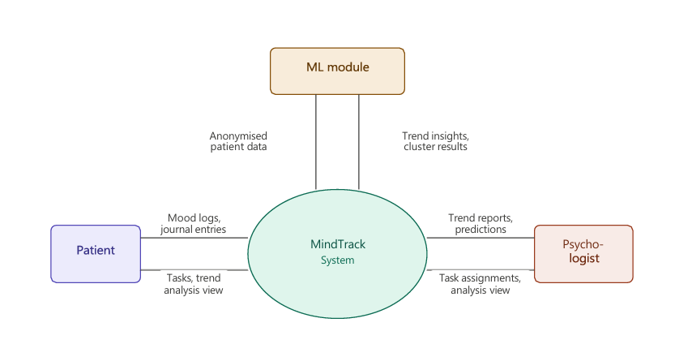
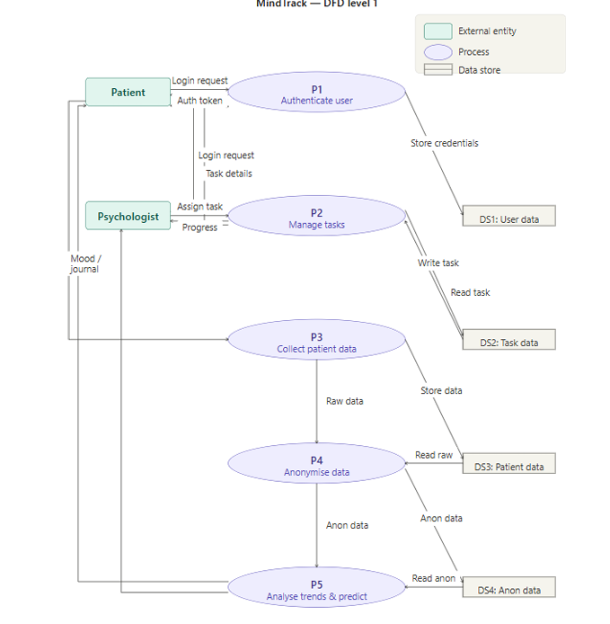
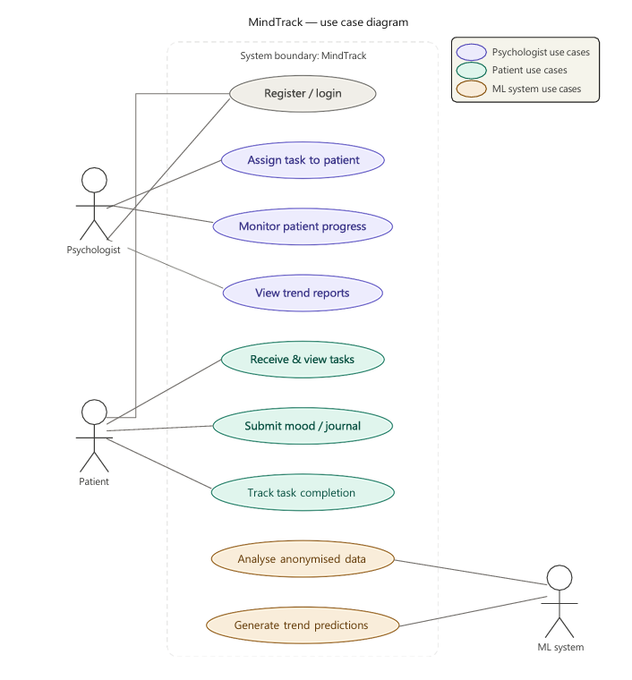
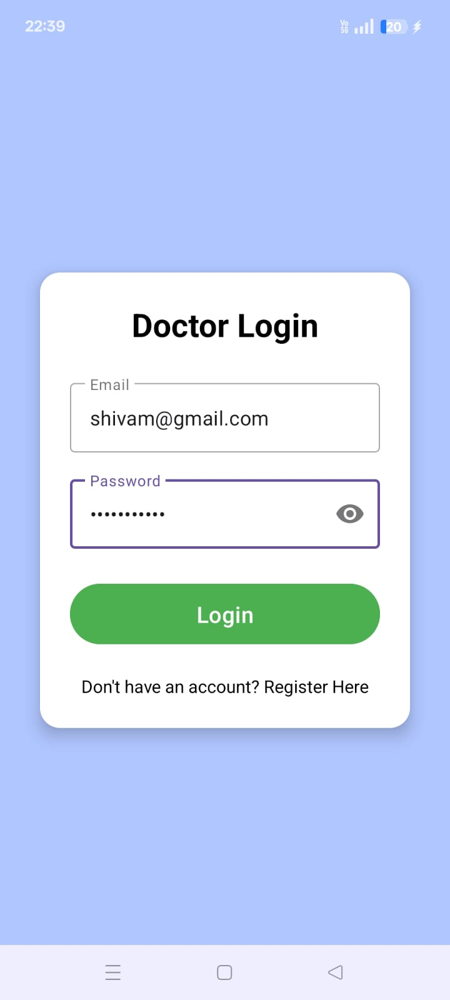
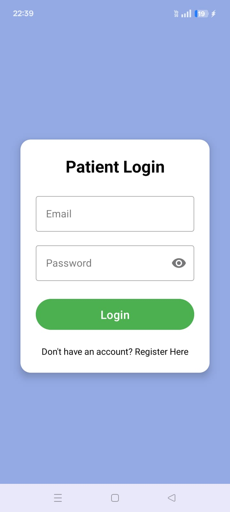
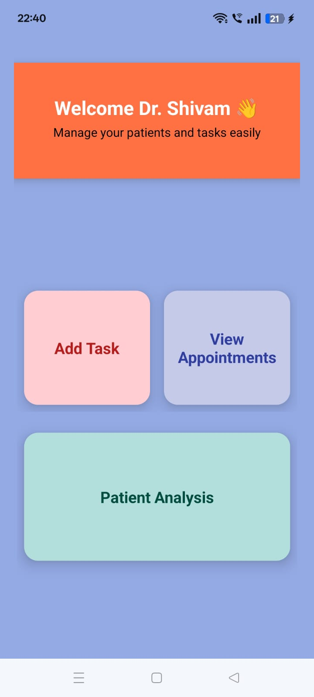
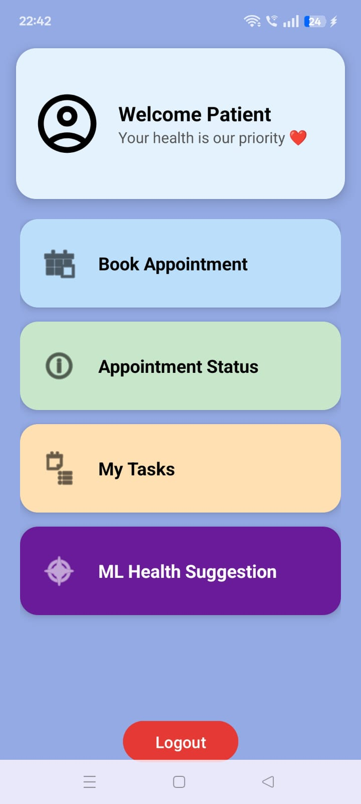
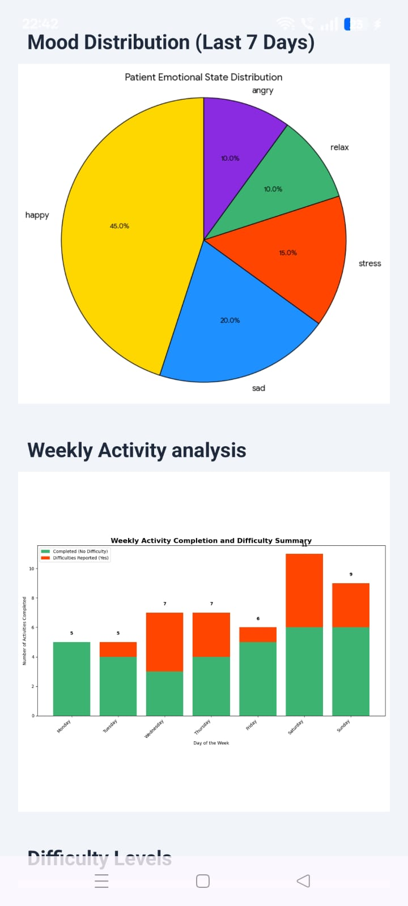
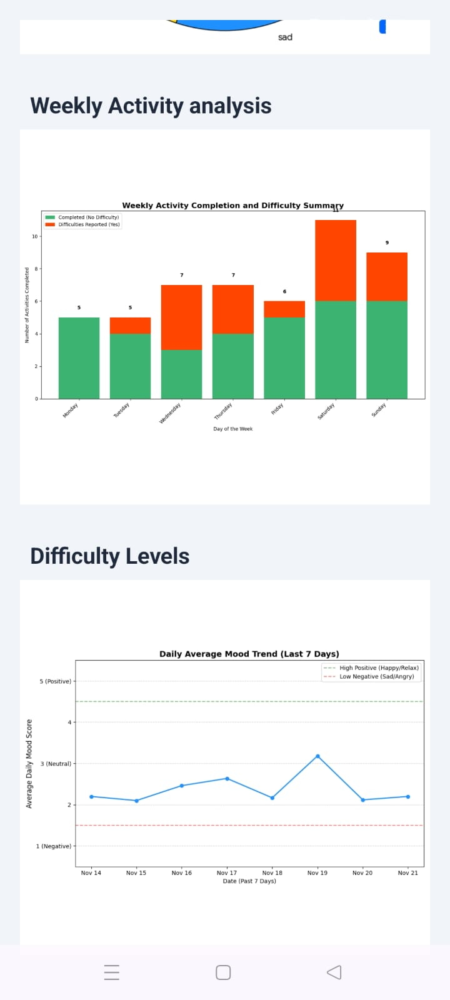
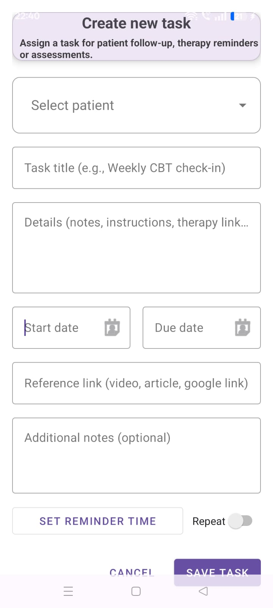

# 🧠 MindTrack: Doctor–Patient Mental Health Task Assignment & Trend Analysis System

<p align="center">
  
  
  
  
  
  
</p>

<p align="center">
  <b>D. Y. Patil College of Engineering & Technology, Kolhapur</b><br/>
  Department of CSE (Data Science) — Final Year B.Tech Project 2025–26
</p>

---

## 👥 Team Members

| Name | Roll No. | Unique ID | Exam Seat No. |
|---|---|---|---|
| Miss. Saloni Rajan Naik | 21 | EN21129121 | 25326 |
| Mr. Shivam Dnyanoba Katkade | 22 | EN22158098 | 25347 |
| Mr. Om Vijay Mahajan | 23 | EN22229362 | 25288 |
| Mr. Sakib Husen Pendhari | 46 | EN22177597 | 25323 |

**Project Guide:** Ms. A. M. Chavan, Department of CSE (Data Science)

---

## 📄 Publication

> **MindTrack: A Doctor–Patient Mental Health Task Assignment and Trend Analysis System**  
> *International Journal of Scientific Research in Engineering and Management (IJSREM)*  
> Volume: 10 | Issue: 05 | May 2026 | ISSN: 2582-3930 | DOI: [10.55041/IJSREM63433](https://doi.org/10.55041/IJSREM63433)

---

## 📋 Table of Contents

1. [Abstract](#-abstract)
2. [Problem Statement](#-problem-statement)
3. [Objectives](#-objectives)
4. [Features](#-features)
5. [System Architecture](#-system-architecture)
6. [Data Flow Diagrams](#-data-flow-diagrams)
7. [Use Case Diagram](#-use-case-diagram)
8. [Technology Stack](#-technology-stack)
9. [Module Details](#-module-details)
10. [Machine Learning Approach](#-machine-learning-approach)
11. [Privacy & Security](#-privacy--security)
12. [Screenshots](#-screenshots)
13. [Result Analysis](#-result-analysis)
14. [Installation & Setup](#-installation--setup)
15. [Future Scope](#-future-scope)
16. [References](#-references)

---

## 📝 Abstract

**MindTrack** is a comprehensive Android application designed to enhance the communication and therapeutic process between psychologists and their patients. The application serves as a dedicated platform for patient management, task assignment, and psychological trend analysis.

Mental health care is often constrained by periodic clinical sessions, limiting a psychologist's visibility into a patient's day-to-day emotional condition, task adherence, and behavioral changes between appointments. MindTrack addresses this gap by enabling:

- 🔐 Secure doctor–patient communication
- 📋 Therapeutic task assignment and tracking
- 📓 Journaling and mood logging
- 📅 Appointment scheduling
- 🤖 Machine-learning-based trend discovery from anonymized data

The system provides **separate interfaces** for psychologists and patients, and uses unsupervised machine learning to identify common stressors, emotional patterns, and behavioral trends across an entire patient caseload — enabling evidence-informed, personalized mental healthcare.

---

## ❓ Problem Statement

> *"To design & develop MindTrack, an Android application with ML trend discovery."*

The current mental health care workflow is largely **session-based and reactive**:

- Psychologists have limited access to structured, day-to-day patient data
- Patients may struggle to maintain continuity in therapeutic exercises outside of appointments
- Studies suggest approximately **50% of patients** with depression or anxiety discontinue prescribed behavioral exercises within the first two weeks if not actively monitored
- Traditional tools lack machine learning capabilities to detect behavioral trends at a population level

---

## 🎯 Objectives

1. Design and implement a user-friendly Android application with **separate dashboards** for psychologists and patients
2. Enable **secure task assignment** from psychologist to patient with real-time tracking of task completion
3. Collect and manage patient-submitted data such as **mood logs and journal entries** in a secure manner
4. Apply **anonymization and unsupervised machine learning** techniques for discovering trends in emotional and behavioral patterns
5. Generate **meaningful reports** to support psychologists in identifying recurring issues
6. Provide **appointment scheduling** functionality for seamless doctor–patient interaction

---

## ✨ Features

### 👨‍⚕️ Psychologist Side
| Feature | Description |
|---|---|
| Dashboard | Patient list, task assignment forms, completion summaries, analytics panel |
| Task Assignment | Create and assign therapeutic tasks (journaling, CBT, mindfulness) with deadlines |
| Patient Monitoring | Real-time task completion tracking via Firestore listeners |
| Analytics Reports | K-Means cluster summaries and weekly mood trend visualizations |
| Appointment Management | Configure availability, confirm/reschedule/cancel bookings |

### 🧑‍💼 Patient Side
| Feature | Description |
|---|---|
| Dashboard | Pending tasks, mood history graphs, journal entries, upcoming appointments |
| Task Completion | View and update task status (pending → in-progress → completed) |
| Mood Logging | Daily mood rating on a scale of 1–10 |
| Journaling | Submit journal entries for therapeutic reflection |
| Appointment Booking | View available slots and book appointments directly |
| ML Health Suggestion | Receive insights and suggestions based on behavioral trends |

---

## 🏗️ System Architecture

MindTrack operates through a **cloud-backed architecture** with the following major components:

```
┌────────────────────────────────────────────────────────────────────┐
│                          Cloud Backend                             │
│                                                                    │
│  ┌─────────────────┐          ┌─────────────────────────────────┐  │
│  │  Patient App    │◄────────►│  Firebase Auth & Cloud Functions│  │
│  └─────────────────┘          └─────────────────────────────────┘  │
│                                            │                       │
│  ┌─────────────────┐                       ▼                       │
│  │ Psychologist App│◄──────►  ┌────────────────────────────────┐   │
│  └─────────────────┘          │   Firestore Database (NoSQL)   │   │
│                                └────────────────────────────────┘  │
│                                            │                       │
│                                ┌───────────▼──────────────────┐    │
│                                │   Analytics Pipeline          │    │
│                                │                              │    │
│                                │  ┌────────────────────────┐  │    │
│                                │  │  Data Anonymization    │  │    │
│                                │  │       Layer            │  │    │
│                                │  └───────────┬────────────┘  │    │
│                                │              ▼               │    │
│                                │  ┌────────────────────────┐  │    │
│                                │  │   ML Analytics Module  │  │    │
│                                │  │ (scikit-learn/TensorFlow│  │    │
│                                │  └───────────┬────────────┘  │    │
│                                │              ▼               │    │
│                                │  ┌────────────────────────┐  │    │
│                                │  │  Reporting Interface   │  │    │
│                                │  │ (Psychologist Dashboard│  │    │
│                                │  └────────────────────────┘  │    │
│                                └──────────────────────────────┘    │
└────────────────────────────────────────────────────────────────────┘
```

### Architecture Components

| Component | Role |
|---|---|
| **Patient Application** | Task viewing, completion updates, mood tracking, journaling, appointment requests |
| **Psychologist Application** | Task creation, patient monitoring, appointment management, trend report review |
| **Backend Server (Firebase Cloud Functions)** | Authentication, request routing, access control, storage operations |
| **Database Layer (Firestore NoSQL)** | Stores user profiles, tasks, completion records, appointments, patient inputs |
| **Data Anonymization Layer** | Removes personally identifiable attributes before analytical processing |
| **ML Module (scikit-learn + TensorFlow)** | K-Means clustering, trend analysis on anonymized behavioral data |
| **Reporting Interface (Matplotlib)** | Presents visual analytical insights to psychologists |

> 📌 *Architecture diagram sourced from the published paper (Fig. 1)*

---

## 🔄 Data Flow Diagrams

### Level 0 — Context Diagram
<p align="center">
  
</p>


### Level 1 — Process Decomposition
<p align="center">
  
</p>

---

## 🎭 Use Case Diagram

<p align="center">
  
</p>

---

## 🛠️ Technology Stack

| Layer | Technology |
|---|---|
| **Frontend** | Android Studio, Java, XML |
| **Authentication** | Firebase Authentication (JWT Tokens) |
| **Backend Logic** | Firebase Cloud Functions |
| **Database** | Firestore (NoSQL) |
| **ML & Analytics** | Python, scikit-learn, TensorFlow |
| **Visualization** | Matplotlib, MPAndroidChart |
| **Additional Processing** | Data Anonymization Pipeline |
| **Activity Monitoring** | Android Accelerometer API |
| **Push Notifications** | Firebase Cloud Messaging |
| **Version Control** | Git |

### Libraries Used

```python
# Machine Learning & Analytics
scikit-learn    # K-Means clustering, unsupervised learning
tensorflow      # Deep learning models (LSTM - future)
pandas          # Data manipulation
numpy           # Numerical processing
matplotlib      # Chart & graph generation
seaborn         # Statistical visualizations

# Android
Firebase SDK (Firestore, Authentication)
Android Navigation Component
MPAndroidChart  # In-app chart rendering
```

---

## 📦 Module Details

The system is developed using an **Agile-inspired iterative methodology** organized into 4 sprints:

### Module 1 — Interface Module
- Role-selection screen at registration directing users to appropriate onboarding flows
- **Patient Dashboard:** pending tasks, mood history graphs, journal entries, upcoming appointments
- **Psychologist Dashboard:** patient list, task assignment forms, completion summaries, analytics panel

### Module 2 — Task Management & Data Collection Module
- Psychologists create task templates (e.g., *"Write a gratitude journal for 10 minutes"*, *"Complete a 5-minute breathing exercise"*)
- Assign tasks with deadlines to specific patients
- Push notifications via Firebase Cloud Messaging when new tasks are assigned
- Task status updated in real time: `Pending → In-Progress → Completed`
- All submitted responses stored for progress tracking and aggregate analysis

### Module 3 — Scheduling Module
- Patients view psychologist's available slots and book appointments
- Psychologists configure weekly availability from dashboard
- Real-time Firestore notifications for booking requests
- Confirm, reschedule, or cancel bookings
- Confirmed appointments visible in both parties' calendar views

### Module 4 — ML-Based Data Analysis Module
- Processes anonymized user-generated health data
- K-Means clustering on behavioral feature vectors
- Weekly mood distribution plots via Matplotlib
- Trend outputs stored in dedicated analytics Firestore collection (isolated from patient identity)

---

## 🤖 Machine Learning Approach

The analytical component is designed for **trend discovery**, not direct diagnosis.

### Primary Method: K-Means Clustering

```
Behavioral Feature Vectors (per patient):
├── Mood variability (scale 1–10, daily log)
├── Task completion rate (weekly %)
├── Journaling frequency (entries/week)
├── Appointment adherence (%)
└── Activity level (from accelerometer: sedentary / light / moderate)
```

**Clustering Result (k=3):**
- 🟢 **High-engagement group** — frequent mood logs, high task completion
- 🟡 **Irregular-engagement group** — inconsistent participation
- 🔴 **Low-engagement group** — minimal logging, low task completion

### Trend Indicators
- Rolling-window statistics over mood log sequences
- Weekly mood trend summaries as line plots
- PCA projection for cluster visualization

### Future: LSTM Sequential Models
```
Input:  7-day mood + behavioral sequence
Output: Predicted mood trajectory (next 7 days)
Goal:   Enable proactive intervention suggestions
```

### Dataset
- Publicly available mental health datasets from Kaggle and open research repositories
- Attributes: daily mood entries, sleep patterns, stress levels, activity records, task completion rates, sentiment scores from journals
- Preprocessing: missing value handling, normalization, categorical encoding, feature extraction using Pandas, NumPy, scikit-learn

---

## 🔐 Privacy & Security

MindTrack places strong emphasis on data privacy throughout the entire data lifecycle:

| Protection Layer | Implementation |
|---|---|
| **Authentication** | Firebase Authentication with secure JWT session tokens |
| **Role-Based Access** | Firestore security rules — patients cannot access other patients' data |
| **Journal Privacy** | Psychologists restricted from reading raw journal text without patient consent flags |
| **Cloud Storage** | Protected by Firestore security rules |
| **Data Anonymization** | All data stripped of name, email, and profile identifiers before analytics |
| **Isolation** | Personal identity records and analytical outputs stored in separate Firestore collections with no cross-referencing links |

---

## 📱 Screenshots

> *All screenshots are from the functional prototype tested on Android API levels 28, 31, and 34.*

### Login Screens
| Doctor Login | Patient Login |
|---|---|
|  |  |

> *(Fig. 7.1 — Doctor Login Screen, Fig. 7.2 — Patient Login Screen from project report)*

### Dashboard Screens
| Psychologist Dashboard | Patient Dashboard |
|---|---|
|  |  |

> *(Fig. 7.3 — Doctor Dashboard with Add Task, View Appointments, Patient Analysis; Fig. 7.4 — Patient Dashboard with Book Appointment, My Tasks, ML Health Suggestion)*

### Analytics & Task Screens
| Mood Distribution & Weekly Activity Analysis | Difficulty Levels & Mood Trend |
|---|---|
|  |  |

> *(Fig. 7.5 & 7.6 — Mood Distribution pie chart, Weekly Activity bar chart, Daily Average Mood Trend line graph)*

### Doctor Management Screens
| Patient Overview (ML Analysis) | Create New Task |
|---|---|
|  |  |

> *(Fig. 7.7 — Shows 8 Completed / 22 Remaining / 30 Patients with ML Analysis Chart; Fig. 7.8 — Task creation form with patient selector, title, details, dates, reminder)*

---

## 📊 Result Analysis

The system was evaluated across **all four modules** on **three Android devices** (API levels 28, 31, 34).

| Metric | Result |
|---|---|
| Task-to-receipt latency | < 2 seconds (all test cases) |
| Average read latency (4G) | 0.8 seconds |
| Concurrent booking race conditions | None detected (multi-device testing) |
| ML clustering (k=3, 50 synthetic patients) | Meaningful PCA separation achieved |
| API levels tested | 28, 31, 34 |
| Modules validated | 4 / 4 |

### Key Outcomes
- ✅ Separate role-enforced user views for psychologists and patients
- ✅ Real-time task synchronization via Firestore listeners
- ✅ Patient data storage & retrieval with cloud integration
- ✅ Appointment scheduling with end-to-end booking, confirmation, and calendar display
- ✅ K-Means clustering module differentiating patient engagement profiles
- ✅ Weekly mood trend visualizations generated from anonymized data

---

## ⚙️ Installation & Setup

### Prerequisites

- Android Studio (latest stable version)
- Java JDK 11 or higher
- Python 3.8+ (for ML module)
- Firebase project (free tier sufficient)
- Android device or emulator (API level 28+)

### Step 1 — Clone the Repository

```bash
git clone https://github.com/YOUR_USERNAME/MindTrack.git
cd MindTrack
```

### Step 2 — Firebase Setup

1. Go to [Firebase Console](https://console.firebase.google.com/) and create a new project
2. Enable **Authentication** (Email/Password)
3. Enable **Firestore Database** (start in test mode)
4. Enable **Cloud Functions**
5. Download `google-services.json` and place it in `/app` directory

### Step 3 — Android App Setup

```bash
# Open in Android Studio
File > Open > Select the cloned MindTrack folder

# Sync Gradle dependencies
Tools > Android > Sync Project with Gradle Files

# Add google-services.json to /app directory
```

### Step 4 — Python ML Module Setup

```bash
cd ml_module
pip install -r requirements.txt
```

**requirements.txt:**
```
scikit-learn
tensorflow
pandas
numpy
matplotlib
seaborn
firebase-admin
```

### Step 5 — Deploy Cloud Functions

```bash
cd functions
npm install
firebase deploy --only functions
```

### Step 6 — Build & Run

```bash
# In Android Studio
Build > Make Project
Run > Run 'app'

# Select your connected device or emulator (API 28+)
```

### Firestore Database Structure

```
firestore/
├── users/
│   └── {userId}/
│       ├── name, email, role (patient/psychologist)
│       └── profileData
├── tasks/
│   └── {taskId}/
│       ├── assignedTo, assignedBy, title, description
│       ├── startDate, dueDate, status
│       └── reminderTime
├── moods/
│   └── {moodId}/
│       ├── userId, rating (1-10), timestamp
│       └── notes
├── journals/
│   └── {journalId}/
│       ├── userId, content, timestamp
│       └── sentimentScore
├── appointments/
│   └── {appointmentId}/
│       ├── patientId, psychologistId, dateTime
│       └── status (pending/confirmed/cancelled)
└── analytics/          ← isolated from patient identity
    └── {reportId}/
        ├── clusterSummary, moodDistribution
        └── weeklyTrends
```

---

## 🔮 Future Scope

| Enhancement | Description |
|---|---|
| **Wearable Device Integration** | Connect with smartwatches/fitness bands to collect heart rate, sleep quality, and real-time physiological data |
| **NLP on Journal Entries** | Transformer-based models (BERT/GPT) for sentiment polarity and emotional theme extraction; automated journal summaries for psychologists |
| **Predictive Early-Warning Alerts** | LSTM-based longitudinal mood prediction to flag patients at elevated risk of symptom deterioration |
| **AI-Based Recommendation System** | Personalized therapy suggestions and task recommendations based on behavioral patterns |
| **Multilingual Support** | Extend accessibility to non-English speaking patients |
| **Enhanced Patient Dashboard** | Per-patient analytics module for deeper individual progress review |
| **Activity Monitoring Module** | Full integration of accelerometer data for movement pattern classification |

---

## 📚 References

1. World Health Organization, "Depressive disorder (depression)," *WHO Fact Sheets*, Mar. 2023. [WHO Link](https://www.who.int/news-room/fact-sheets/detail/depression)
2. J. Torous et al., "New tools for new research in psychiatry," *JMIR Mental Health*, vol. 3, no. 2, p. e16, 2016.
3. D. C. Mohr, M. Zhang, and S. M. Schueller, "Personal sensing," *Annu. Rev. Clin. Psychol.*, vol. 13, pp. 23–47, 2017.
4. S. Santoshkumar et al., "Psych Match: A Mental Health Tracker," K.C. College of Engineering, Thane.
5. S. P. R. et al., "Mental Health Tracker," *Int. J. Creative Research Thoughts*, vol. 13, no. 5, 2025.
6. N. Alias and N. Ibrahim, "Mental Health Journal and Mood Tracker System," *Applied Inf. Technol. Comput. Sci.*, vol. 6, no. 2, 2025.
7. A. Sharma et al., "Predicting mental health from digital footprints using machine learning," *Proc. IEEE ICDM*, 2017.
8. M. N. Burns et al., "Harnessing context sensing to develop a mobile intervention for depression," *J. Med. Internet Res.*, vol. 13, no. 3, 2011.
9. J. Torous et al., "Smartphones, sensors, and machine learning to advance real-time prediction for suicide prevention," *Curr. Psychiatry Rep.*, vol. 20, no. 7, 2018.
10. R. Wang et al., "StudentLife: assessing mental health and behavioral trends of college students using smartphones," *Proc. ACM UbiComp*, 2014.

---

## 🏆 Acknowledgments

We extend our heartfelt gratitude to:

- **Prof. DR. A. K. Gupta Sir** — Executive Director, DYPCET, for visionary leadership
- **Prof. DR. S. D. Chede Sir** — Principal, DYPCET, for guidance and encouragement
- **DR. G. V. Patil Sir** — Head of Department, Data Science, for invaluable mentorship
- **Ms. A. M. Chavan** — Project Guide, for expert guidance throughout the project

---

## 📜 License

This project is developed as an academic project for Final Year B.Tech at D. Y. Patil College of Engineering & Technology, Kolhapur.

```
Academic Year: 2025–26
Institution: D. Y. Patil College of Engineering & Technology, Kolhapur
Department: CSE (Data Science)
```

---

<p align="center">
  Made with ❤️ by Team MindTrack | DYPCET Kolhapur 2025–26
</p>
